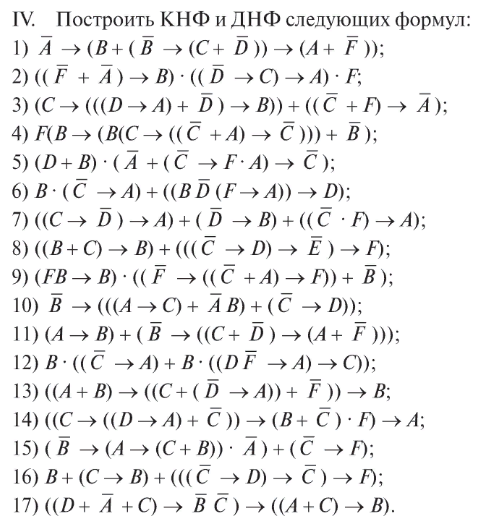
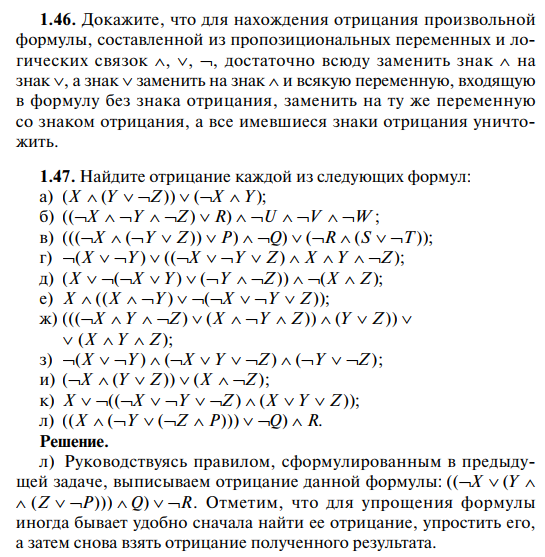
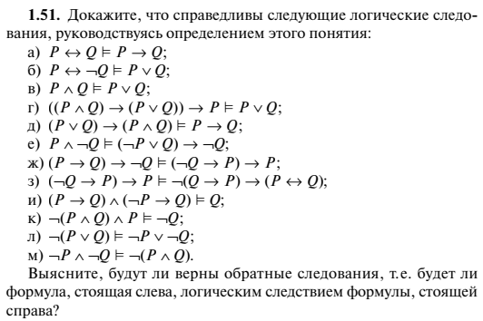
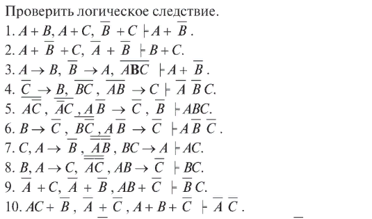
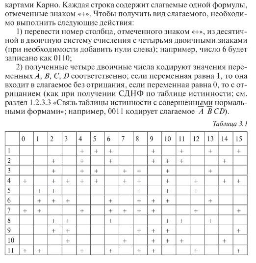
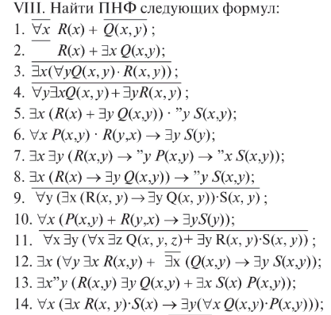
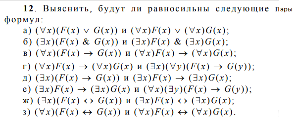

## Задачи

### Нормальные формы логики высказываний

*1*. Доказать эквивалентность с помощью равносильных преобразований или таблицы истинности:
* $(A(A+C)(B+C)) \sim (AB + AC)$
* $((A+B)(B+C)(C+D)) \sim (AC + BC + AD)$
* $((AB+C)(AC+B)(BC+A) \sim (AB+AC+BC)$
* $((A+B+C)(B+C+D)(C+D+A)) \sim (AB + AD + BD + C)$

*2*. При каких значениях переменных ложна следующая формула:
* $(X+Y) \to ((\neg X \& Y) \vee (X \& \neg Y))$
* $((X \to (Y\& Z)) \to (\neg Y \to \neg X)) \to \neg Y$
* $\neg X \& Y \vee \neg Y \& Z \vee X \neg Z$
* $(\neg X \vee Y)(\neg Y \vee Z)(X \vee \neg Z)$
* $((X\vee Y)(Y \vee Z)(X \vee Z)) \to (X \& Y \& Z)$

*3*. 

*4*. Найти СДНФ для ДНФ $(x \& \neg x) \vee x \vee (y \& z \& y)$.

*5*. Преобразовать предыдущую формулу к СКНФ.
                                                                
*6*. 

### Логическое следствие

*7*. 

*8*. 

### Текстовые задачи логики высказываний

*9*. Выяснить, кто из четверых виновен на основе следующих высказываний.
«Если Петров виновен, то виновен Кулагин. Неверно, что виновность 
Родионова влечет виновность Сидорова, и неверно, что Кулагин 
виновен, а Сидоров нет».

*10*. Записать рассуждение в виде одного предложения.
«На вопрос, какая завтра будет погода, синоптик ответил: 1) если 
не будет ветра, то будет пасмурная погода без дождя; 2) если будет 
дождь, то будет пасмурно и без ветра; 3) если будет пасмурная погода, 
то будет дождь и не будет ветра. Подумав немного, синоптик 
уточнил, что три его высказывания можно лаконично записать в виде 
одного предложения».

*11*. Записать рассуждение в виде трех простейших высказываний.
«На вопрос, какая завтра будет погода, синоптик ответил: а) если 
будет мороз, то будет ясная погода без снега; б) если не будет мороза, 
то погода будет пасмурной; в) не будет снега, если небо будет ясным; 
г) будет ясная погода без снега. Подумав немного, синоптик уточнил, 
что четыре его высказывания сводятся к трем простейшим высказываниям».

*12*. Решить логическую задачу.
«В одном королевстве были незамужние принцессы, голодные 
тигры и приговоренный к казни узник. Всякому узнику, осужденному 
на смерть, король давал последний шанс. Узнику предлагалось 
угадать, в какой из двух комнат находится тигр, а в какой принцесса. 
Хотя вполне могло быть, что король в обеих комнатах разместил 
принцесс или тигров. Выбор надо было сделать на основании табличек 
на дверях комнаты. Известно, что утверждения на табличках 
были либо оба истинными, либо оба ложными. Надпись на первой 
комнате гласила: «По крайней мере, в одной из этих комнат находится 
принцесса». Надпись на второй комнате гласила: «Тигр сидит 
в первой комнате». Какую дверь должен выбрать узник?»

### Текстовые задачи логики предикатов

*13*. Рассмотрим информационную систему под условным названием «Кадры», которая содержит сведения о сотрудниках некоторой организации. Для представления информации используются атрибуты: ФАМ – фамилия сотрудника, ПОЛ –пол сотрудника, ВОЗР – возраст, ДОЛЖ – должность, НОМ – номер отдела (подразделения) этой организации. Сведения хранятся в виде двух отношений СОТР(ФАМ, НОМ, ДОЛЖ), АНК(ФАМ, ПОЛ, ВОЗР). Первое отношение содержит фамилии сотрудников, их должность и номера отделов, где работают эти сотрудники. Второе отношение хранит анкетные данные: фамилию, пол и возраст сотрудника. Кроме того, система может вычислять отношения Мен(x,y)=«x меньше y», определенное на множестве натуральных чисел, точнее, на домене атрибута ВОЗР.

Перевести следующие запросы на язык логики первого порядка:

а. Кто из сотрудников–мужчин старше 40 лет?

б. Кто из сотрудников старше 40 лет и в каком отделе работает?

в. Кто из программистов старше 40 лет и в каком отделе работает?

г. В каких отделах все программисты моложе 40 лет?

д. В каких отделах работают пенсионеры?

е. В каких отделах все программисты – пенсионеры?

*14*. Рассмотрим предметную область, которую можно назвать «Учеба на факультете».
Даны следующие множества: СТУД, ПРЕП, ПРЕД, ГР, КУРС, АУД, ДЕНЬ, НАЧ, которые интерпретируются соответственно
как множества студентов, преподавателей. изучаемых предметов, групп, курсов, аудиторий, дней недели, времени начала занятий.
На этих множествах заданы предикаты ГР(СТУД,ГР), КУРС(ГР,КУРС), РАСП(НАЧ,ДЕНЬ,ГР,ПРЕД,ПРЕП,АУД), РАНЬШЕ(НАЧ,НАЧ).
Первый определяет принадлежность студента группе. Второй – группы курсу, третий представляет собой
факультетское расписание на неделю (предполагается, что нет поточных лекций, лабораторных занятий с частью группы
и что все занятия проводятся каждую неделю). Последний предикат определяет, когда одно занятие проводится раньше другого по времени,
в течение одного дня. В сигнатуру можно добавлять константы. Которые интепретируются как элементы указанных множеств.
Например, ИВАНОВ – студент, ПЕТРОВ – преподаватель, 03–101 – группа, 09-00 – начало занятий. ФИЗКУЛЬ – физкультура.

Перевести следующие утверждения:

а. Один и тот же преподаватель не может в одно и то же время проводить занятия в разных аудиториях.

б. Два занятия по одному предмету в один и тот же день не проводятся.

в. Занятия физкультурой проводятся сразу во всех группах.

г. В течение недели проводятся два занятия физкультурой.

д. Занятия физкультурой проводятся последней парой.

е. В субботу проводится не более трех занятий.

ж. У каждой группы 4 и 5 курсов есть день, свободный от аудиторных занятий.

з. В группе 03–101 каждый день есть не менее трех занятий.

и. Если в группе в какой то день есть занятие, то есть, по крайней мере, еще одно.

*15*. Дано утверждение: “Некоторые из первокурсников
знакомы с кем-либо из спортсменов. Но ни один из первокурсников не знаком ни с одним любителем подледного лова”.
Какие из следующих утверждений будут следствием
этого и почему:
а) “ни один спортсмен не является любителями подледного лова”,
б) ”некоторые из спортсменов не являются любителями
подледного лова”,
в) “найдется спортсмен, который любит подледный
лов”?
Для ответа на вопрос записать утверждение на языке логики предикатов.

*16*. Пройти "Логический тест - 1" в [тестирующей системе](http://p98414p4.beget.tech/test).

### Минимизация логических формул

*17*. Минимизировать формулу от 4 переменных, находящуюся в СДНФ и представленную в следующей таблице
методом Квайна или картами Карно.

 

### Исчисление высказываний

*18*. 

а) Доказать теорему $\vdash \neg\neg A \to (\neg\neg A \to A)$.

б) Выведите формулу $(A \vee B) \to (B \vee A)$, используя аксиомы и правила вывода.

в) Докажите выводимость формулы $A \to (\neg A \to B)$.

г) Докажите выводимость закона Пирса: $((A \to B) \to A) \to A)$, используя теорему о дедукции.

### Логика предикатов

*19*. 

*20*. 

*21*. Какие из нижеприведенных формул являются общезначимыми:
* $\exists x\, (P_1(x) \& P_2(x)) \to (\exists x\, P_1(x) \& \exists x\, P_2(x))$;
* $\exists x\, (P_1(x) \& P_2(x)) \to (\exists x\, P_1(x) \to \exists x\, P_2(x))$;
* $\exists x\, P(x) \to \forall x\, P(x)$;
* $\exists x\, P(x) \& (r \to Q(x)) \to (\forall x \, (P(x) \to \neg Q(x)) \to \neg r)$. 

### Литература

[Пруцков, Волкова -- Математическая логика и теория алгоритмов (2018)](https://znanium.com/catalog/document?id=309231)

Игошин -- Сборник задач по математической логике и теории алгоритмов (2019)

Замятин -- Математическая логика и теория алгоритмов (2008)

## Контрольные работы

[Контрольная работа № 1 "Алгебра высказываний"](https://www.vfmadi.ru/dok/obraz_program/metodich/090301/16.pdf)

[Контрольная работа № 2 "Исчисление высказываний"](https://www.vfmadi.ru/dok/obraz_program/metodich/090301/16.pdf)

[Контрольная работа № 3 "Алгебра предикатов"](https://www.vfmadi.ru/dok/obraz_program/metodich/090301/16.pdf)

[Контрольная работа № 4 "Исчисление предикатов"](https://www.vfmadi.ru/dok/obraz_program/metodich/090301/16.pdf)

[Контрольная работа № 5 "Машина Тьюринга"](https://www.vfmadi.ru/dok/obraz_program/metodich/090301/16.pdf)
